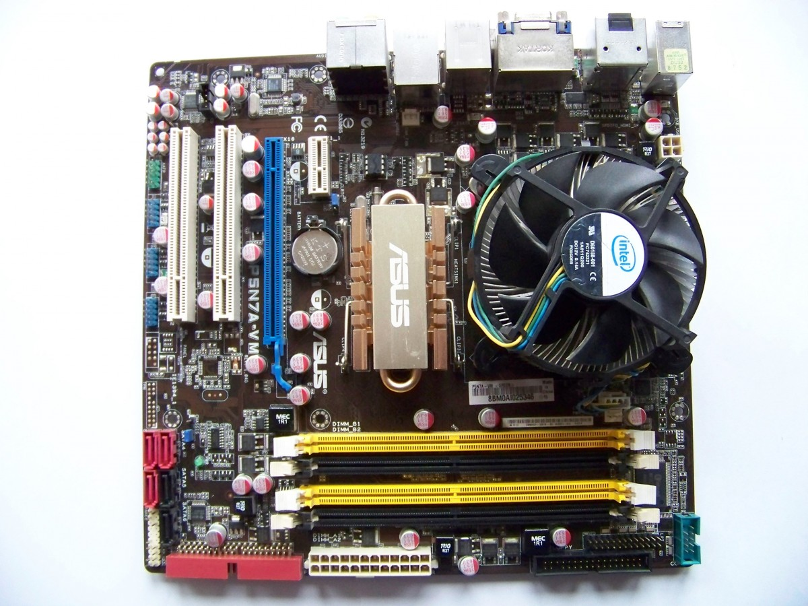

# UD 1. Hardware de un sistema informático

## 1. Sistema Informático

La informática es la ciencia que se encarga de estudiar todo lo relacionado con los sistemas informáticos, incluyendo desde los temas relativos a su arquitectura y su fabricación, hasta los temas referidos a la organización y almacenamiento de la información, sin olvidar los relativos a la creación y uso del software, o a la formación del personal informático. Para ello se basa en múltiples ciencias como las matemáticas, la física, la electrónica, etc.


Para empezar conviene visitar la siguiente dirección en la que hace un repaso a la evolución histórica de la creación de los ordenadores y otras cosas: [Evolución Histórica de los Ordenadores](https://es.wikiversity.org/wiki/Algoritmia_y_programaci%C3%B3n_b%C3%A1sica/Aspectos_introductorios).



Se define **sistema informático** como un conjunto de elementos físicos \(hardware\) y de elementos lógicos \(software\) interconectados entre sí, destinados a gestionar el tratamiento automático y racional de la información, entendiendo por esto, su organización, su transmisión, su procesamiento y/o su almacenamiento.


Se incluye como parte fundamental del sistema informático al conjunto de personas que lo utiliza, ya sean usuarios, administradores, programadores, etc. El elemento humano es un componente imprescindible, ya que los sistemas informáticos son creados, desarrollados y utilizados por humanos para su propio provecho.

En un Sistema Informático se debe distinguir entre hardware y software:

* **Hardware** es todo lo que forma parte del ordenador, que puede ser tocado físicamente. Es decir; teclado, ratón, monitor, placa base, procesador, memoria, disco duro, cables, etc. Es la "maquinaria" necesaria utilizada para el tratamiento automático de la información.
* **Software** es el elemento lógico, es todo aquello que es "intangible". Es el conjunto de programas y datos que permiten manejar el hardware, controlando y coordinando su funcionamiento para que realice las tareas deseadas.
* El software lo integran tanto los programas como los datos:
  * **Los programas** están formados por un conjunto de órdenes o instrucciones que se utilizan para procesar los datos que se le introducen como información. Son necesarios para la gestión y el control de los equipos y de los trabajos de los usuarios.
  * **Los datos** son en sí la información que los programas deben procesar, utilizando para ello los diferentes elementos hardware que componen el sistema informático. Son, en definitiva, el objeto o razón de ser del sistema informático.

Los sistemas informáticos han evolucionado, desde que en principio todos sus componentes: físicos, lógicos y humanos estaban localizados en un mismo lugar, a estar formados por subsistemas interconectados a través de redes, que pueden llegar a estar a miles de kilómetros entre sí, integrando sistemas complejos de procesamiento de la información. Y estos subsistemas pueden estar compuestos tanto por un superordenador, como por un solo ordenador personal, o por redes locales de ordenadores, o por una combinación de todos ellos.

El sistema informático más simple estará formado por un sólo ordenador y por un usuario que ejecuta los programas instalados en él.


Se define ordenador como una **máquina electrónica**, con algunas partes mecánicas, compuesta por, al menos, una unidad de proceso, y por equipos periféricos, controlada por programas que deben estar almacenados en su memoria central, destinada al tratamiento automático de la información que le es suministrada. Es una máquina de propósito general ya que puede realizar gran variedad de trabajos a gran velocidad y con gran precisión.


Existen muchos tipos de ordenadores, así que pueden ser clasificados en función de diversos criterios.

## 2. Arquitectura Hardware: Componentes funcionales

La arquitectura funcional vigente hoy día en la construcción de ordenadores fue concretada por John Von Neumann a mediados del siglo pasado. Está basada en los siguientes componentes que se interrelacionan entre sí a través del bus del sistema que actúa como canal de comunicación entre ellos:

* La Unidad Central de Proceso \(CPU, por sus iniciales en inglés\).
* La memoria principal.
* Los sistemas de Entrada/Salida.


Puedes ampliar información sobre esta arquitectura y su autor en el siguiente enlace de la Wikipedia. [Arquitectura Von-Neumann.](http://es.wikipedia.org/wiki/Arquitectura_de_von_Neumann)


### 2.1 Unidad Central de Proceso o CPU

La Unidad Central de Proceso es el componente que debe tener un ordenador para considerarse como tal. Viene a ser como un cerebro que debe controlar, dirigir y coordinar todas las operaciones que necesite realizar el ordenador. Todo ello lo hace siguiendo las instrucciones que recibe de los programas que esté ejecutando.

Para que la CPU pueda ejecutar un **programa** es necesario que esté alojado en su memoria central, desde donde va extrayendo en secuencia cada una de sus instrucciones, analizándolas y emitiendo las órdenes necesarias al resto de componentes que deban intervenir para completar su ejecución.

La Unidad Central de Proceso esta integrada en el Procesador Central o microprocesador y acompañada por una pequeña cantidad de **registros** de Memoria necesarios para su funcionamiento.

Por tanto en la Unidad Central de Proceso como parte integrante del Microprocesador, deben existir dos unidades:

* **La Unidad de Control**, que se encarga de ejecutar los programas, controlando su secuencia, interpretando y ejecutando sus instrucciones. Se encarga también de controlar al resto de componentes; como los periféricos, la memoria, la información que hay que procesar, etc., a tenor de lo que van necesitando las instrucciones.
*  **La Unidad Aritmético-Lógica** que hace los cálculos matemáticos y los cálculos lógicos necesarios para su funcionamiento.

La memoria central, conocida como RAM \(Random Access Memory\), es la encargada de almacenar los datos y las instrucciones de los programas que deben ejecutarse, así como toda aquella información que el sistema necesite para su funcionamiento. Está constituida por un grupo de registros capaces de retener información en su interior mientras el ordenador se encuentre encendido. Cuando el ordenador se apaga, se pierde su contenido.

Los sistemas de Entrada/Salida son circuitos electrónicos que permiten el intercambio de información entre la CPU y los periféricos. Las unidades de entrada se utilizan para cargar programas y datos en la memoria principal desde los periféricos de entrada, y las unidades de salida se utilizan para sacar los resultados de los procesos realizados a través de los periféricos de salida.

Los Buses del Sistema son el conjunto de circuitos eléctricos que conectan la CPU con el resto de unidades para comunicarse entre sí. Cada bus es un conjunto de cables o pistas de un circuito integrado, que permiten la transmisión en paralelo de la información entre los diferentes componentes del ordenador.

Hay tres clases distintas de buses:

* **El bus de instrucciones y datos**. Utilizado para trasladar tanto instrucciones como datos desde la memoria RAM al resto de componentes del ordenador y viceversa.
* **El bus de control**. La CPU transmite por él las órdenes \(microórdenes\) al resto de unidades. Y recibe de ellas señales indicando su estado.
* **El bus de direcciones.** Por él se transmiten las direcciones de destino de los datos que se envían por el bus de datos.

Veamos el siguiente ejemplo para entender su interacción: cuando la CPU tiene que obtener la información contenida en una posición de memoria, debe indicar su dirección mediante el bus de direcciones, pero también debe mandar una señal de lectura por el bus de control. Para recibir, a continuación, dicha información por el bus de datos.

### 2.2 Periféricos / Almacenamiento Externo

Los periféricos son dispositivos electrónicos, unidades externas que se conectan al ordenador a través de los buses de entrada/salida, integrándose en el sistema que pasa a controlarlos como parte de sí mismo desde el momento en el que reconoce su conexión. Existen infinidad de periféricos, diferentes por su diseño o por su función; algunos tienen como misión facilitar la entrada de información al ordenador, mientras que otros facilitan su salida, los hay cuya utilidad es el almacenamiento permanente de datos o los que permiten la conexión a otras máquinas para intercambio de información. Pero no todos ellos son imprescindibles, lo más habitual es disponer de teclado, ratón, monitor, impresora, altavoces y conexión a red.

Según su función se pueden clasificar en:

* **Unidades de entrada**: Son las encargadas de introducir la información o los datos desde el exterior a la memoria central, preparando la información para que pueda ser entendida por la máquina. Por ejemplo: el teclado.
* **Unidades de salida:** Son las encargadas de sacar al exterior los datos o resultados de los procesos realizados, mostrándolos de una forma comprensible para el usuario. Por ejemplo: la pantalla.
* **Unidades de entrada/salida:** Son las que se utilizan tanto para entrada como para salida de información. Algunas de estas unidades no necesitan realizar procesos de **conversión** ya que manejan la información en formato binario, otras necesitan procesos de conversión para trabajar con los usuarios y otras necesitan procesos de conversión para comunicarse con otros dispositivos. Por ejemplo: las tarjetas de red inalámbricas que intercambian información con otros ordenadores.
* **Unidades de almacenamiento externo:** Conocidas como dispositivos de almacenamiento masivo de información. Son utilizadas para guardar tanto programas como datos de forma permanente, con el objetivo de recuperarlos para ser procesados las veces que sea necesario. La información se almacena en formato **binario** y se mantiene aun faltando la alimentación eléctrica. Por ejemplo: las memorias USB.

Algunos periféricos necesitan **soportes** adicionales para representar la información o para almacenarla. En estos casos hay que tener claro que el periférico no almacena información sino que es el medio utilizado para obtener o depositar la información en su soporte. Por ejemplo: El lector de _DVD_ es el periférico que lee la información del disco, que es el soporte donde esta almacenada. O la impresora que necesita el papel como soporte para escribir sobre él.

## 3. Componentes físicos de un ordenador actual 

La arquitectura de un ordenador define la estructura funcional de cada una de sus partes, pero se hace necesario implementar dicha estructura mediante hardware de fabricación y comercialización actual.

La imagen que normalmente se tiene de un ordenador es la de una carcasa, con un diseño más o menos bonito, a la que están conectados como mínimo un teclado, un ratón y un monitor. El ordenador en sí, está dentro de la carcasa y está constituido por la placa base, el procesador y la memoria. El resto de elementos que contiene son los periféricos que nos permiten comunicarnos con él, como la tarjeta gráfica, la de sonido, o las unidades de almacenamiento como el disco duro o el lector de DVD.

Claro que también podemos pensar en un portátil, pero éste no deja de ser un ordenador con todos sus componentes, de reducido tamaño, integrados en su interior.

Así, en función de las características tecnológicas de los componentes empleados en su construcción \(su tamaño, su grado de miniaturización, su capacidad de proceso, su capacidad de almacenamiento, su velocidad de proceso, su velocidad de transmisión, etc.\) se van a construir ordenadores personales más o menos potentes: Portátiles, TabletsPC, PDAs, Smartphones, y hasta consolas de juegos. Pero también se fabrican servidores, mainframes y por supuesto, superordenadores.

Vamos a hacer un estudio de los distintos elementos utilizados para el montaje de un ordenador personal de sobremesa de uso general \(por ser la arquitectura más accesible\), en base a los componentes físicos que se fabrican y se comercializan en la actualidad. Analizando en la medida de lo posible sus características de funcionamiento particulares.

Los distintos componentes deben seguir determinados **estándares** de fabricación, sobre todo en lo relativo a sus conexiones e **interfaces**, para permitir su completa integración en el sistema y mantener la compatibilidad de funcionamiento entre ellos.

La base sobre la que se asienta el montaje de un ordenador personal es la **placa base** **o placa madre**. A ella se conectan de una u otra forma, a través de los buses de interconexión, todos y cada uno de sus componentes. Las líneas de suministro eléctrico, procedentes de la fuente de alimentación, proporcionan corriente continua para su funcionamiento. 

Como la mayoría de estos componentes necesitan de un recipiente a modo de envase que los contenga y los proteja, se han diseñado para ello las cajas de ordenador, también conocidas como carcasas o chasis.

### 3.1 Cajas de ordenador

Las cajas de ordenador se fabrican de diversos materiales como acero, aluminio, plástico, metacrilato, etc. o con una combinación de ellos. Deben tener la suficiente resistencia para aguantar tanto el peso de los componentes que se coloquen en su interior, como el calor que generen, y por supuesto la suficiente capacidad como para poder albergarlos con una distribución adecuada.

Estas cajas se fabrican siguiendo unos diseños basados en unos factores de forma estándares cada uno de los cuales tiene definidas sus propias características de tamaño, forma, capacidad, etc. Así que podemos elegir alguno de entre los distintos formatos de caja más habituales en la actualidad:

* **Torres, semitorres, y minitorres.** Son los modelos clásicos, aunque la semitorre es la que se suele comprar más habitualmente. La **diferencia** entre ellas está en su **altura** que depende del **número de bahías** que disponga. A mayor numero de bahías, más dispositivos podrá contener y más aumentará su altura. Aceptan una gran variedad de formatos de placas bases, **desde mini-iTX y micro-ATX** las más pequeñas, **hasta E-ATX** las de mayor tamaño.
*  **Sobremesa:** Son similares a las minitorre, pero se colocan de forma horizontal. Lo que obliga a rotar 90 grados los dispositivos extraíbles de su frontal.
*  **Barebone** **y Slim**: Son cajas de pequeño tamaño diseñadas sobre todo para ocupar poco espacio. Esto conlleva que su interior admite pocos dispositivos, o ninguno, pero esto se intenta compensar aumentando el número de conectores para dispositivos externos.

Con independencia de su forma o tamaño, también deberán tenerse en cuenta los siguientes aspectos a la hora de seleccionar una caja u otra:

* **Refrigeración:** Deberán situarse ventiladores necesarios para completar el flujo de aire interno. 
* **Posibilidad de ampliación.**
* **Conectividad:** La caja deberá tener conectividad suficiente para las funciones que vaya a desarrollar. Un ejemplo de esto pueden ser los conectores USB que suelen encontrarse en las parte frontales o superiores de las cajas.
* **Posición fuente alimentación:** Es preferible que las fuentes se sitúen en la parte inferior de las cajas.
* **Filtros anti polvo** que permitan mantener la caja lo más limpia posible.

De una carcasa se espera que en su interior contenga ciertos compartimentos dedicados a alojar la fuente de alimentación, los discos duros, las unidades ópticas y por supuesto la placa base y las tarjetas de expansión que se le conecten.

En el **panel frontal** se sitúan los botones de encendido y reinicio y los **LED** que indican si el ordenador esta encendido o si se está utilizando el disco duro, etc. También las bocas de las unidades extraíbles y algunos conectores externos de uso habitual, como los de USB o de lectores de tarjetas de memoria.

En el **panel trasero** se pueden ver los conectores que asoman directamente desde la placa base y desde las tarjetas de expansión. Así como la toma de corriente eléctrica y la salida de ventilación de la fuente de alimentación.

También podemos ver, estratégicamente distribuidas por distintas zonas de la caja, **rejillas o aberturas** por las que debe circular el aire, libremente o con ayuda de ventiladores situados en su interior, cuyo fin es disipar el calor que generan los componentes internos.


Puedes ampliar información sobre el factor de forma de las cajas de ordenador en el primer enlace y ver algunos diseños en el catalogo de este vendedor. [Factores de forma en Wikipedia.](http://es.wikipedia.org/wiki/Caja_de_computadora)


#### 3.1.1 Fuentes de alimentación

La fuente de alimentación es un elemento imprescindible cuya misión es **alimentar de corriente continua** a todos los componentes que se integran en el interior del ordenador y a los de bajo consumo que se conectan desde el exterior. Para ello debe ser capaz de suministrar una potencia no menor de 350 vatios. Hay que tener en cuenta que una fuente con potencia insuficiente puede causar problemas de mal funcionamiento y hasta dañar el equipo.

La fuente de alimentación suele venir preinstalada en la caja del ordenador, aunque no siempre es así, para poder elegir con independencia de la caja un modelo que se adapte a nuestras necesidades, por ejemplo, que sea de mayor potencia, que sea más silenciosa, o que tenga luces decorativas, etc.

La fuente de alimentación es una pequeña caja metálica, con muchas rejillas para ventilarse, de la que salen los cables con los conectores necesarios para alimentar los componentes del interior del ordenador con voltajes de más y menos 12 voltios, más y menos 5 voltios y más 3,3 voltios. \(12 voltios para los motores de las unidades de almacenamiento y ventiladores y 5 y 3,3 voltios para el resto de componentes\).

Existen las **fuentes modulares** que permiten el acoplamiento de los cables con los conectores necesarios, pudiendo retirar los cables sobrantes no utilizados para que no molesten dentro de la caja.

Desde la parte trasera de la fuente de alimentación podemos ver el conector para el cable de la conexión a la red eléctrica y la rejilla de ventilación por la que su propio ventilador extrae el aire caliente que ella misma genera.

La parte trasera, **adicionalmente** puede disponer de otros elementos como:

* Un conector para alimentación eléctrica del monitor.
* Un interruptor de apagado total de la fuente, que de otra manera, si el ordenador se apaga queda en modo de funcionamiento standby, para poder reiniciarse con un toque de teclado, un movimiento de ratón o una señal externa desde la tarjeta de red.


En este enlace puedes ampliar la información sobre fuentes de alimentación, así como, los diferentes modelos que se pueden encontrar en el mercado. [Fuentes alimentación.](https://www.geektopia.es/es/technology/2014/02/11/noticias/las-mejores-fuentes-de-alimentacion-del-momento.html)


### 3.2 Placas base

La Placa Base es **una tarjeta de circuito impreso a la que se conectan los demás elementos de un ordenador.** Contiene una serie de circuitos integrados entre los que se encuentra el chipset, que le sirve como centro de conexión entre el procesador, la memoria RAM, los buses de expansión y otros dispositivos.

Su diseño debe cumplir unos estándares basados en el "factor de forma", que define algunas de sus características físicas, por ejemplo:

* La forma de la placa base con sus dimensiones exactas \(ancho y largo\).
* La posición de los anclajes, o sea, el lugar donde se sitúan los huecos para los tornillos que la fijan al chasis.
* Las áreas donde se sitúan algunos de sus componentes como el zócalo del procesador, las ranuras de expansión y los conectores de la parte trasera para teclado, ratón, USB, red, etc.
* Las conexiones eléctricas de la fuente de alimentación: la cantidad de conectores y su forma, sus voltajes, etc.

Podemos ver sus principales componentes en el siguiente gráfico.

La placa base es un componente fundamental a través del cual **se integran e interrelacionan todos y cada uno de los dispositivos** del ordenador.

Todos los conectores tienen conexión directa con alguno de los dos componentes del **chipset,** los llamados **puente norte y puente sur**, en ingles **northbridge** y **southbridge** respectivamente. Se trata de dos circuitos integrados que con el tiempo han ido recogiendo en su diseño funcionalidades de controladores que antes fueron independientes.

Así el **puente norte** se encarga de controlar funciones como las **comunicaciones entre el procesador, la memoria, el sistema gráfico**, incluso en algunos modelos suele integrar **controladoras de vídeo, sonido y red**. **El puente sur,** por su parte **lleva el control del resto de puertos internos y externos** de la placa base. Por tanto, el chipset hace que la placa base funcione como un sistema "nervioso", que interconecta todos sus componentes por medio de diversos buses, permitiendo la comunicación entre ellos.

La placa base incluye un chip conocido como **BIOS** con un software propio o **firmware**, que le permite realizar funcionalidades básicas, como reconocimiento y auto chequeo de los dispositivos instalados, gestión básica de vídeo y del teclado. Es el software que se encarga de la parte del arranque del equipo que es independiente del sistema operativo.


En el primer enlace encontrarás más información sobre el "factor de forma" y sobre los tamaños estándar de las placas base. Además, en el segundo enlace podrás encontrar más información y modelos de placas. [Factores de forma.](http://es.wikipedia.org/wiki/Factor_de_forma) \| [Información placas base.](https://www.geektopia.es/es/technology/2014/03/08/articulos/mejores-placas-base-tarjetas-madre-del-momento-por-rango-de-precio.html)


### 3.3 Procesadores

Es la parte más importante del ordenador porque es el encargado de controlar al resto de componentes. Se trata de un microchip compuesto de millones de microcomponentes recogidos en una cápsula, normalmente cerámica, de la que salen una serie de patillas o contactos, que hay que acoplar en el zócalo de la placa base.

Existen varios fabricantes de microprocesadores para ordenadores personales, siendo los más importantes AMD e Intel por ser los que más investigan y más productos sacan al mercado.

Hay diversas características que definen un procesador:

* **La velocidad de cálculo**, velocidad de trabajo o frecuencia de reloj que se mide en **Hertzios**, o en alguno de sus múltiplos. Con esta medida se especifica el número de ciclos por segundo, que tiene relación con el máximo de operaciones por segundo que es capaz de procesar. Se supone que cuantos más hertzios tenga un procesador, más rápido es y puede realizar más operaciones. Aunque hay que diferenciar esta velocidad interna de la velocidad externa conocida como Front-Side Bus \(FSB\), que es la velocidad de funcionamiento del bus de comunicación entre el procesador y la placa base. Esta medida es útil para comparar procesadores de un mismo fabricante, ya que iguales frecuencias de reloj pueden suponer diferentes velocidades de trabajo si la comparación se hace con procesadores de diferentes fabricantes.
* **La tecnología de fabricación**, que se mide en **nanómetros**. Es una medida utilizada para referirse al tamaño de los transistores que componen los procesadores. Cuanto menor sea el tamaño de los transistores, más cerca pueden colocarse unos de otros. Esto permite reducir la cantidad de energía eléctrica necesaria para comunicarlos, y por consiguiente disminuir el calor generado durante el funcionamiento del microprocesador, que puede alcanzar mayores frecuencias de reloj. Se están investigando procesadores con tecnología de 4 nm.
* **El tamaño y el nivel de la memoria caché**. Es una memoria de gran velocidad utilizada para almacenar la copia de una serie de instrucciones y datos a los que el procesador necesita estar accediendo continuamente. La inclusión de una buena cantidad de memoria cache en el procesador hace que mejore su rendimiento porque permite reducir el número de accesos, mucho más lentos, a la memoria RAM.

  Suele haber varios tipos de memoria caché que se organizan por niveles, creando una jerarquía basada en la proximidad al núcleo del procesador, de forma que cuanto mas cerca esté, trabajará a mayor velocidad pero será de menor tamaño. Nos podemos encontrar con:

  * **Caché de primer nivel o L1**: Caché que está integrada en el núcleo del procesador y trabaja a su misma velocidad. Suele estar dividida en dos partes dedicadas, una a trabajar con las instrucciones y otra con los datos.
  * **Caché de segundo nivel o L2:** Mayor capacidad de almacenamiento, aunque será más lenta. En los procesadores más relevantes se dispone de una cache L2 por cada núcleo.
  * **Cache de tercer nivel o L3**: Aun más lenta que la L2, pero con mayor tamaño, dispone de un espacio dedicado para ella en el chip del procesador.


Para obtener más información sobre los procesadores de estos dos fabricantes.

* [Modelos de procesadores de AMD y su evolución.](http://www.configurarequipos.com/doc1043.html)
* [Modelos de procesadores de Intel y su evolución.](http://www.configurarequipos.com/doc1051.html)
* [Modelos más recientes de procesadores.](https://www.geektopia.es/es/technology/2013/05/08/noticias/los-mejores-procesadores-para-jugar-por-rango-de-precio-mayo-2013.html)
* [Memoria cache.](https://www.profesionalreview.com/2019/05/02/memoria-cache-l1-l2-y-l3/)


#### 3.3.1 Procesadores. Núcleos y características de funcionamiento

Siguiendo con las características de los procesadores, vamos a detallar algunas que tienen mucho que ver con el funcionamiento de los procesadores más modernos, independientemente de si estos son utilizados por ordenadores de sobremesa, portátiles o grandes ordenadores.

Una característica de los procesadores actuales es el **número de núcleos** que se integran en cada encapsulado y que pueden trabajar de forma simultánea. Como se está haciendo difícil, o poco rentable, aumentar la frecuencia de trabajo de los nuevos procesadores para continuar incrementando su rendimiento, los fabricantes han aprovechado el altísimo nivel de integración conseguido en su fabricación y han incluido más de un núcleo en el mismo encapsulado.

En relación con el funcionamiento debemos destacar la **arquitectura** de 32 bits o 64 bits, que son los tamaños utilizados en la actualidad. Se refiere al número de bits de los registros que componen el procesador. De este tamaño depende la arquitectura del resto del ordenador que tiene que trabajar con el mismo número de bits.

La elección de un procesador condiciona la elección de la placa base, pues debe incluir un chipset acorde que pueda aprovechar todas sus características y un zócalo compatible en el que pueda instalarse. Para ello el número y la disposición de sus contactos debe coincidir en ambos.

Otra característica no menos importante de los procesadores es que durante su funcionamiento producen tanto calor que pueden llegar a quemarse si no se adoptan las medidas para evitarlo. Así que se hace imprescindible el uso de sistemas para disipar ese calor.

Lo habitual es colocar sobre ellos un elemento metálico \(de aluminio o cobre\), con mucha superficie de contacto con el aire, que absorba el calor del procesador disipándolo en el aire, esto se conoce como **disipación pasiva**. Como en los procesadores actuales esto no es suficiente, se acoplan ventiladores a los disipadores para que evacuen el calor con mayor rapidez mediante sus flujos de aire, produciendo una **disipación activa**.

Existen sistemas alternativos como por ejemplo la refrigeración líquida que extrae el calor del procesador y de otros componentes aprovechando su mayor conductividad. Aunque tiene el inconveniente de tener que instalar circuitos cerrados para hacer pasar el líquido por las zonas a refrigerar además de necesitar un radiador externo para que el líquido se desprenda del calor.


Para obtener más información sobre la refrigeración del calor de los procesadores y otros componentes.

* [Métodos de refrigeración para componentes de ordenador.](https://direcciondemiblogjhonballe.blogspot.com/2019/09/metodos-existente-para-la-refrigeracion.html)
* [¿Cómo funciona un disipador de calor?](https://www.quonty.com/blog/disipador-de-calor/)


### 3.4 Memorias

La memoria de acceso aleatorio RAM \(del inglés: Random-Access Memory\) es la memoria que necesita el procesador para ejecutar los programas. En ella busca las instrucciones y los datos, y en ella guarda los resultados.

Físicamente, los módulos de memoria RAM son pequeñas tarjetas de circuito impreso a las que se sueldan los chips de memoria, por una o por ambas caras. Llevan en uno de sus cantos una fila de pines o contactos metálicos para insertarlos en los zócalos de memoria de la placa base.

Los módulos que actualmente se encuentran en el mercado son del tipo DDR \(Double Data Rate\) o doble tasa de transferencia de datos que vienen integradas en tarjetas de memoria **Dimms**.

Los encontramos diferentes versiones, que podemos reconocer por el número de contactos y por la posición en la que tienen la muesca que les impide su colocación de forma incorrecta. En los enlaces del apartado "Para saber más" podéis encontrar las principales diferencias entre unas versiones y otras.  

La placa base debe ser compatible con las memorias, tanto en el estándar del zócalo, así como, admitir la frecuencia de estas. De nada servirá poner una memoria con mayor frecuencia si la placa base no lo soporta.

Por último, debe tenerse en cuenta la cantidad de memoria que soporta el sistema operativo con el que se vaya a trabajar, pero esto lo analizaremos con más detalle en las siguientes unidades.  

### 3.5 Discos duros

El disco duro, o HDD \(del inglés Hard Drive Disk\) es un dispositivo de almacenamiento que emplea un sistema de grabación magnética para almacenar datos digitales.

Esta compuesto por uno o mas discos rígidos, de aluminio o de material vitrocerámico, que se recubren de una fina capa de material magnetizable, encerrados en una caja sellada, para evitar la entrada de impurezas que puedan perjudicar su funcionamiento.

La información se registra en ellos mediante variaciones en el campo magnético, de forma que un punto puede estar magnetizado en un sentido, para representar un 1, o en otro para representar un 0.

Los discos rígidos, también llamados platos están unidos por un eje a un motor que los hace girar simultáneamente a gran velocidad. Según modelos son comunes velocidades de giro de los discos de 5.400 revoluciones por minuto o de 7.200 revoluciones por minuto, aunque en algunos discos basados en servidores pueden llegar a hasta 15.000 RPM

Hoy en día podemos encontrar discos de **estado solido** denominados **SSD** \(Solid State Drive\), los cuales no funcionan con discos . Los SSD almacenan los archivos en microchips con memorias flash interconectadas entre sí e incluyen un procesador integrado. 

Las interfaces para conexiones internas, son las utilizadas por los dispositivos que se alojan dentro del ordenador:

* **El interfaz ATA o PATA\(Parallel ATA\)**, más conocidos como **IDE** y sus variaciones: están quedando desfasados en favor del nuevo interfaz SATA \(Serial ATA\). La velocidad de su mejor versión llegaba a soportar velocidades de hasta 166 MB/s.
* **El interfaz SATA**: Utiliza un bus serie para la transmisión de datos, siendo mas rápido y eficiente que el bus paralelo IDE. Existen tres versiones, SATA 1, 2 y 3 con velocidades de transferencia de hasta 1,5, 3 y 6 GB/s respectivamente.
* **El interfaz SCSI**: Son interfaces preparadas para discos de gran capacidad de almacenamiento y de gran velocidad de rotación que se utiliza en servidores a nivel profesional. De estos también existen tres versiones: SCSI Estándar \(Standard SCSI\), SCSI Rápido \(Fast SCSI\) y SCSI Ancho-Rápido \(Fast-Wide SCSI\) con velocidades de 5, 10 y 20 MB/s respectivamente. Y también existe SAS \(Serial Attached SCSI\): la nueva y más rápida versión serie del SCSI en paralelo.
* **PCI Express:** Puede lograr un ancho de banda muy superior al que se obtiene mediante el puerto SATA III. Concretamente tenemos un máximo de 32 GB/s frente a los 6 GB/s que nos ofrece SATA III.

Interfaces para conexiones externas son las utilizadas por los discos duros externos que se conectan ocasionalmente al ordenador: A través de USB, de **FireWire**, de Serial ATA externo \(eSATA\), de SCSI y SAS externos o mediante conexión de red alámbrica o Wi-Fi.


Para obtener más información sobre los tipos de discos duros.

* [HDD vs SSD.](https://www.xataka.com/basics/hdd-vs-ssd)
* [SSD.](https://www.profesionalreview.com/2017/06/13/disco-ssd-sata-vs-m-2-vs-ssd-pci-express/)


### 3.6 Tarjetas de vídeo

Una tarjeta de vídeo o tarjeta gráfica, es una tarjeta de expansión adicional, que adapta los datos enviados por el procesador al monitor o a un proyector para que el usuario pueda verlos representados.

La conexión de estos adaptadores o controladores gráficos a la placa base se hace actualmente a través del bus PCI Express x16, ya que necesitan un bus rápido de comunicación. Hay modelos de placas base que integran en su circuitería un controlador gráfico de suficiente calidad como para un uso normal del ordenador, pero que se queda escaso de potencia trabajando para aplicaciones que hagan un uso intensivo de representaciones gráficas, como por ejemplo juegos en 3D.

Para satisfacer las superiores necesidades gráficas de algunos programas, de diseño o de juegos, hay placas que ofrecen la posibilidad de conectar más de una tarjeta de vídeo de modo que ambas trabajen como una sola aumentando considerablemente su potencia.[                    ](https://ikastaroak.birt.eus/edu/es/DAMDAW/SI/SI01/es_DAMDAW_SI01_Contenidos/3.5TarjetaGrafica2.jpg)

Las tarjetas gráficas integran los siguientes componentes:

- **La GPU** es un procesador dedicado en exclusiva al tratamiento de gráficos, que libera al procesador central de esta tarea. Igualmente necesita de sistemas para la disipación del calor que producen.

- **La memoria** que incorporan es para uso exclusivo de la propia tarjeta. Se llama memoria de vídeo y suele ser incluso más eficiente que la RAM del ordenador. Cuando la tarjeta gráfica está integrada en la placa base se reserva para su uso particular una parte de la memoria RAM del ordenador.

Los **sistemas de conexión** más habituales entre la tarjeta gráfica y el monitor son las siguientes, aunque no son las únicas que podemos encontrar:

* **VGA.**
* **DVI.**
* **HDMI**.
* **Display Port.**


 Para obtener más información sobre las tarjetas de vídeo.  [Información sobre tarjetas de vídeo.](http://es.wikipedia.org/wiki/Tarjeta_de_video)


### 3.7 Tarjetas de sonido

Una tarjeta de sonido es una tarjeta de expansión que permite la entrada y salida de audio a través de sus conectores. Normalmente se inserta en una ranura PCI, aunque la mayoría de modelos de placa base ya vienen con la tarjeta de sonido integrada. Las tarjetas de sonido incorporan los conectores tipo mini **jack** que se necesitan para la conexión de los dispositivos de sonido.

Los conectores vienen codificados por colores:

* Entrada analógica para **micrófono**: color **rosa**.
* Entrada analógica **"Line-In": azul.**
* Salida analógica para la señal **estéreo** principal \(altavoces frontales\): **verde**.
* Salida analógica para altavoces **traseros**: **negro**.
* Salida analógica para altavoces **laterales**: **plateado**.
* Salida Digital **SPDIF**: **naranja**.


 Para obtener más información sobre las tarjetas de sonido.  [Información sobre tarjetas de sonido.](http://es.wikipedia.org/wiki/Tarjeta_de_sonido)


### 3.8 Unidades de entrada I

Son todos aquellos periféricos que puede utilizar el usuario para introducir información al ordenador. Para ello será necesario que estén conectados al ordenador de alguna de las formas posibles. La mayoría de las conexiones utilizadas, sobre todo en dispositivos de bajo consumo, reciben la alimentación necesaria a través del propio conector, es el caso del teclado. Pero otros dispositivos cuyo consumo será mayor necesitan tener su propia fuente de alimentación. Por ejemplo algunos escáneres.

**Teclado**

Es una de las unidades de entrada más habituales y casi imprescindibles que utilizamos para enviar información al ordenador mediante la pulsación de sus teclas. Nos permite escribir textos, números y enviar señales de control. Su modo de funcionamiento incluye que lo tecleado aparezca automáticamente en la pantalla, y así comprobar que se ha tecleado lo correcto.

Se conecta al ordenador por medio de un conector de tipo PS/2 \(o mini-din\) a su conexión exclusiva, o por medio de un conector USB. También los hay inalámbricos que necesitan dos terminales con emisor y receptor, uno de ellos en el propio teclado y el otro que debe estar conectado al ordenador por medio de conector PS/2 o USB. Además entre los inalámbricos nos encontramos los que utilizan tecnología bluetooth, que pueden aprovechar los emisores ya incorporados en el ordenador.

**Ratón**

El ratón es un pequeño dispositivo, que al ser desplazado por una superficie plana, mueve sobre la pantalla un cursor que lo representa reflejando sus movimientos.

Dependiendo del modelo, un ratón puede tener dos o más botones, e incluso una o varias ruedas de desplazamiento, que permiten dar diversas órdenes en función del botón pulsado y del número de pulsaciones.

El cursor, que suele tener aspecto de flecha, se utiliza para señalar los objetos gráficos que aparecen en la pantalla.

Para su conexión al ordenador se utiliza su conexión PS/2 exclusiva o una conexión a un USB cualquiera. También como los teclados pueden ser inalámbricos, incluso hay modelos que pueden compartir el mismo transmisor base.

**Escáner**

Se utiliza para explorar objetos y obtener su representación digital. El proceso de digitalizar consiste en, tomar información de cada uno de los puntos de la superficie de un objeto, y representarlos con valores binarios para generar un duplicado virtual que pueda procesar el ordenador.

Utiliza un cabe de tipo USB para conectarse al ordenador, en algunos modelos necesita toma de corriente eléctrica para su propia alimentación.

Existen diferentes tipos de escáner: de sobremesa, de rodillo, de mano, de tambor, cenital, etc.

#### 3.8.1 Unidades de entrada II

Otras unidades de entrada que permiten introducir información al ordenador son:

* **Lectores de códigos de barras**: hay lectores de mano y lectores fijos. Ambos son escáneres especializados en la tarea de leer e interpretar códigos de barras. No se utilizan para obtener el dibujo de las barras que escanean, sino el valor numérico que representan. Según los modelos existen varias posibilidades de conexión al ordenador: USB, puerto serie, Wi-Fi, bluetooth, incluso directamente al puerto del teclado por medio de un adaptador. 
* **Tableta gráfica o tableta digitalizadora**: es un periférico que permite introducir gráficos o dibujos a mano, como si se hiciera con lápiz. y papel. Se trata de una tablilla plana especial sobre la que el usuario simula escribir utilizando el estilete \(o lapicero\) que le acompaña. Aunque en realidad los trazos van apareciendo sobre la pantalla del ordenador. Algunas tabletas tienen delimitadas zonas de actuación especial que actúan como botones al ser tocados con el lápiz, e incluso pueden utilizarse como un ratón de gran precisión ya que permite apuntar y seleccionar los objetos que se encuentran en la pantalla. Las tabletas digitalizadoras actuales suelen conectarse al ordenador mediante USB, aunque hay modelos que lo hacen mediante bluetooth o Wi-Fi. 
* **Micrófono:** es un dispositivo que permite la introducción de sonidos al ordenador como música, señales acústicas o la propia voz. Su conexión se hace a través de un conector, llamado mini jack, proporcionado por la tarjeta de sonido que debe estar incluida en el ordenador para que pueda ser utilizado. También existe otro tipo de micrófonos que se conectan directamente al puerto USB y se comportan como un dispositivo de grabación de voz, sin necesidad de tarjeta de sonido. 
* **Cámara digital:** Dispositivo cuya utilidad es captar imágenes y codificarlas en formato binario para que puedan ser procesadas por el ordenador. Estas capturas pueden ser almacenadas como imágenes estáticas o como imágenes en movimiento. Aunque las imágenes en movimiento, o vídeos, no son más que sucesiones de imágenes fijas captadas en brevísimos intervalos de tiempo. En la actualidad distinguimos dos tipos de cámaras, las llamadas cámaras web, que necesitan un ordenador para transmitir las imágenes al que se conectan mediante USB. O las llamadas cámaras de red, que se conectan a un punto de red, de forma alámbrica o inalámbrica.

  La mayoría de los actuales ordenadores portátiles ya llevan incorporada una diminuta cámara web en su propia carcasa. También existen las cámaras fotográficas y de vídeo digitales, que aun trabajando de forma independiente pueden conectarse al ordenador por medio de cables USB o fireware, para descargar en él sus capturas.


Para que tengas una información más completa sobre las unidades de entrada que hemos tratado, sigue los enlaces que te facilitamos a continuación:

* [Teclados.](http://es.wikipedia.org/wiki/Teclado_%28inform%C3%A1tica%29)
* [Ratones.](http://es.wikipedia.org/wiki/Rat%C3%B3n_%28inform%C3%A1tica%29)
* [Joystick.](http://es.wikipedia.org/wiki/Joystick)
* [Escáner.](http://es.wikipedia.org/wiki/Esc%C3%A1ner_de_computadora)
* [Lectores de código de barras.](http://es.wikipedia.org/wiki/Lector_de_codigo_de_barras)
* [Tabletas digitalizadoras.](http://es.wikipedia.org/wiki/Tableta_digitalizadora)
* [Micrófonos.](http://es.wikipedia.org/wiki/Microfono)
* [Cámaras web.](http://es.wikipedia.org/wiki/C%C3%A1mara_web)


Aunque de uso menos frecuente podemos citar otros periféricos de entrada como:

* Lectores de marcas ópticas que identifican marcas de lápiz en test, en impresos, etc.
* Lectores magnéticos de tarjetas: de crédito, de DNI, etc.
* Lectores de huellas digitales, o del iris del ojo humano, etc.
* Capturadores de señales analógicas procedentes de sensores de humo, o de inundación, de detectores de presencia, o de temperatura, etc. que las convierten en señales digitales para su tratamiento informático. Son utilizadas en la industria o en los hogares para modificar las condiciones ambientales.

